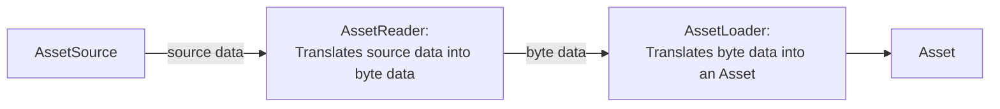
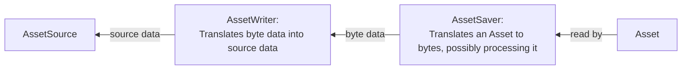
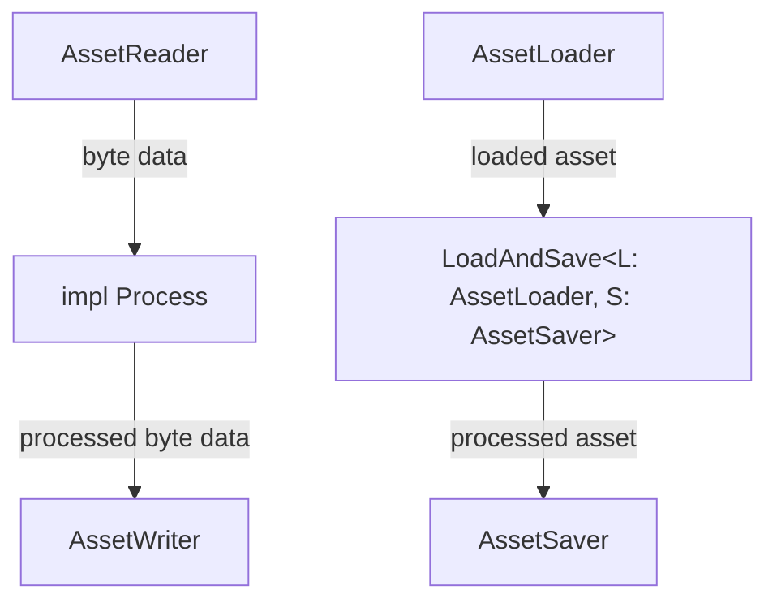
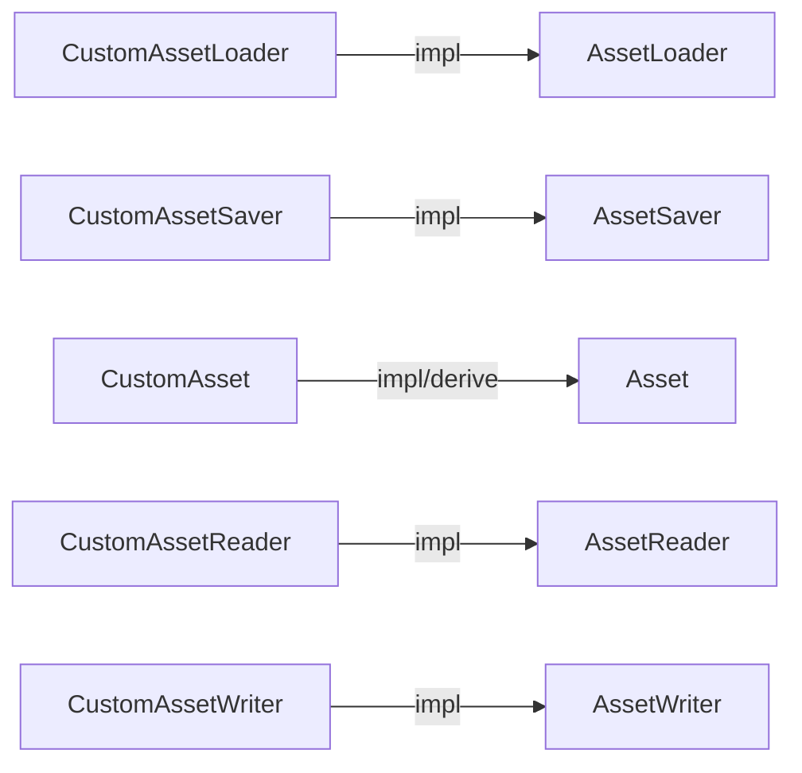
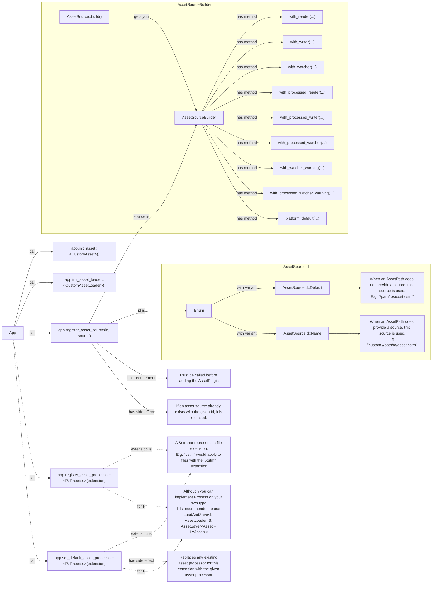
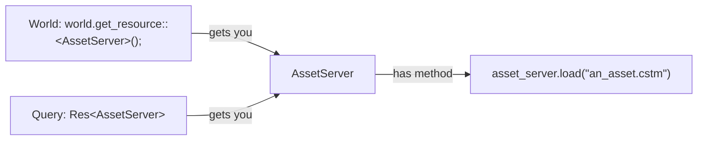

## Bevy_Asset High Level Overview
### Definitions:
- **AssetSource (Trait)**: A source that bytes can be extracted from and/or written to. E.g. filesystem, remote, embedded, etc.
- **AssetReader (Trait)**: Translates from Source data to byte data.
- **AssetWriter (Trait)**: Translates from byte data to Source data.
- **AssetLoader (Trait)**: Translates from bytes to an Asset.
- **AssetSaver (Trait)**: Translates from an Asset to bytes, possibly also processing the Asset.
- **AssetServer (Resource)**: Used to load assets.
- **AssetProcessor (Resource)**: A background processer that loads all assets from a "source" AssetSource, processes them, and then saves them to a "destination" AssetSource.
  - **Meta File**: Produced when Assets are processed and saved. Stored in the same location as the Asset they correspond to.

### Asset Loading:

### Asset Saving:

### Asset Processing:


## Bevy_Asset Usage Overview (Assuming a custom implementation is needed for everything)
### Type Setup
Using bevy's asset system first involves setting up the types that your Asset needs:

### App setup
Secondly, you must set up your App. In this diagram, start from the "App" node in the lower left, and call the necessary methods for your custom asset implementation:

### AssetServer Usage
Lastly, to load your custom asset you can use the AssetServer:


## Bevy Asset Internals
### AssetServer
- 

### AssetProcessor
- contains an exclusive AssetServer which is configured for asset processing requirements
  - Such as?
- contains 'data' which represents the state of the AssetProcessor. This state includes data on
  - what processors and default processors are added
  - the current state of the AssetProcessor (Initializing, Processing, or Finished)
  - asset sources
  - Senders and recievers for initialization and finished "events" that are emitted when the AssetProcessor has its state changed.
  - A log which tracks the state of asset processing to ensure that processing operations are atomic.
- When the AssetProcessor is started, it immediately starts processing all configures assets. Once it is done it blocks on listening for source change events.
  - Processing all files involves 
  - When it recieves a source change event, it takes action based on the event recieved. I.e. if an asset added event is received, it processes that asset.

### Meta files
- Files that communicate to the AssetServer or AssetProcessor how an asset should be handled.
- Contains:
  - AssetMetaMinimal
    - The bare minimum that a .meta file may contain.
      - Lists meta information, such as meta format version and an:
      - AssetActionMinimal, which is an enum with variants Load, Process, and Ignore. Each variant stores the required information for the action it represents.
- Meta files are generated:
  - When processing assets, if an asset does not have a meta file then one is generated from the default meta file for the default processor for an asset's file extension if it exits, otherwise from the loader for that file extension.

### Asset "Lifetime"
 - From the "to be processed' directory
   - File is processed using the local meta file, or the default meta file for this laoder?processor? if local meta file does not exist
   - File is saved to the "not to be processed" directory with a meta file telling bevy what loader it should use to load this file.
PR:
future possibilities?
AssetTransformer chaining?: Any tuple of AssetTransformers with maching inputs an outputs should also be an AssetTransformer. Problem: How to generically combine Settings and Error types. Best guess
```rust
/// Blanket implementation of AssetTransformer for any tuple of AssetTransformers who have the
impl<T: AssetTransformer<AssetOutput = U::AssetInput>, U: AssetTransformer> AssetTransformer for (T, U) {
    type AssetInput = T::AssetInput;
    type AssetOutput = U::AssetOutput;
    type Settings = (T::Settings, U::Settings);
    type Error = ?;

    fn transform<'a>(
        &'a self,
        asset: Self::AssetInput,
        settings: &'a Self::Settings,
    ) -> Result<Self::AssetOutput, Box<dyn std::error::Error + Send + Sync + 'static>> {
        Ok(U::transform(&self.1, T::transform( &self.0, asset, &settings.0)?, &settings.1)?)
    }
}
```


# Bevy Asset Wishlist:
- Runtime loading options settable at load time (currently only settable via .meta file or when adding the loader to the app)
- Runtime processing
  - Set processor options at process time (currently only accessible via .meta file)
- Runtime saving
  - Set saver options at save time (currently only accessible via .meta file)
- Savable/Loadable Handles
  - One source of "truth" for assets location?
    - Asset path for loaded assets.
    - What about manually inserted assets?
    - Asset uuids that point to additional data, such as path, manual construction, etc?
      - Should this be flexible so that users can add new "sources" for assets outside of the asset server or manual construction?
        - Should manual construction just be its own `AssetSource` from the asset server?
          - This begs some questions about save dependencies. Is this supported?
    - Currently `UntypedAssetId` uses asset uuids so that if an asset that fails to load later succeeds, all handles to it will be properly updated. We want to maintain this feature.
- `AssetReader` and `AssetWriter` currently don't have custom error types and instead use a shared error type. Some asset sources will have unique errors, such as http errors for remote://, so `AssetReader`s and `AssetWriter`s should define their own error types.
