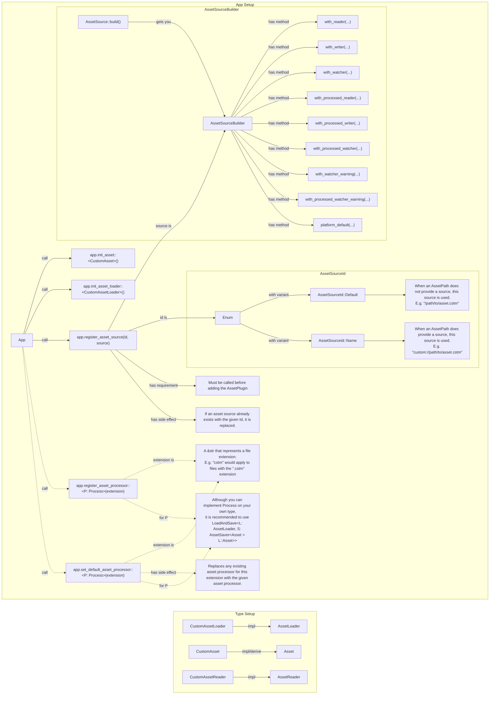

## What problem does this solve or what need does it fill?
Currently bevy_asset is geared toward loading and processing assets.
The current pipeline for loading assets looks like (Assuming a custom implementation for everything is needed):

Definitions:
- Source: A source that bytes can be extracted from. E.g. filesystem, remote, embedded, etc.
- Reader: Translates from Source to byte data.
- Writer: Translates from byte data to Source.
- Loader: Translates from bytes to asset.
- Saver: Translates from asset to bytes.

This system is increadibly flexible, but it is worth noting that saving is unnecessarily coupled to processing.

## What solution would you like?

The solution you propose for the problem presented.

## What alternative(s) have you considered?

Other solutions to solve and/or work around the problem presented.

## Additional context

Any other information you would like to add such as related previous work,
screenshots, benchmarks, etc.
