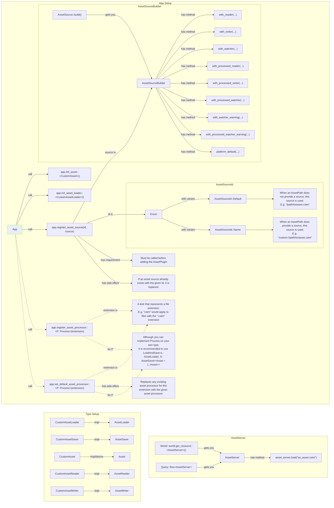

## What problem does this solve or what need does it fill?
Currently bevy_asset is geared toward loading and processing assets.
The current pipeline for loading assets looks like (Assuming a custom implementation for everything is needed):
## Bevy_Asset Usage Graph
Definitions:
- AssetSource: A source that bytes can be extracted from. E.g. filesystem, remote, embedded, etc.
- AssetReader: Translates from Source to byte data.
- AssetWriter: Translates from byte data to Source.
- AssetLoader: Translates from bytes to asset.
- AssetSaver: Translates from asset to bytes, possibly also processing the asset.
- AssetServer: Used to load assets.
- AssetProcessor: A background processer that loads all assets from a "source" AssetSource, processes them, and then saves them to a "destination" AssetSource.
  - Meta File: Produced when assets are processed and saved in the same location as the source asset they correspond to.

Using bevy's asset system involves setting up your app (top subgraph starting with `App`), your types (lower left subgraph), and then using the asset server (lower right subgraph).

TODO:
- Adding the asset plugin is a requirement.
- Describe AssetProcessor behavior

Notes:
What information needs to be conveyed?
- How a user *uses* these systems, which should be visually distinct from
- How these systems work internally, at least to a high level approximation

This system is increadibly flexible, but it is worth noting that saving is unnecessarily coupled to processing.

## What solution would you like?

I would like to split processing and saving into two distinct parts. The current Saver will only be responsible for converting an asset into bytes, and a new Processor will be introduced which is responsible for actually operating on an asset.
So for instance, LoadAndSave<L: Loader, S: Saver> processor would become LoadAndSave<L: Loader, P: Processor, S: Saver>. 

With Savers decoupled from Processors, it would allow us to expose saving functions through the AssetServer that can utilize registered Savers. This API may look something like save::<A: Asset>(path: Path, asset: A). This is primarily useful for saving DynamicScenes, but could also be used for saving things like screenshots.

## Additional context

Any other information you would like to add such as related previous work,
screenshots, benchmarks, etc.
